  

  <a href="https://www.linkedin.com/in/aniket-deshkar">LinkedIn</a> &nbsp;·&nbsp;
  <a href="https://github.com/aniket-deshkar?tab=repositories">Code</a>

I build backend systems and AI agents. My background is in Java, Spring Boot, and microservices; these days, much of my work is in Python, agent orchestration, retrieval, and AWS.

I’m an Assistant Lead AI Engineer, with experience across payments, fleet operations, recruitment, and voice automation. The problems I keep coming back to are practical ones: giving an agent the right context, controlling what it can change, and making its behavior traceable when something goes wrong.

## What I’m building

**[Settlement Sentinel](https://github.com/aniket-deshkar/settlement-sentinel)**  
Investigating settlement mismatches with Google ADK and Gemini. Agents retrieve evidence through MCP and consult a separate policy service through A2A. A human reviews the adjustment before it reaches a simulated ledger. Built around synthetic data, with a FastAPI operator UI and OpenTelemetry tracing.

**[Spring AI Governance](https://github.com/aniket-deshkar/spring-ai-governance)**  
Authorization and approval checks at the point where a Spring AI tool executes. The library wraps tool callbacks, applies Spring Security and argument policies, and records decisions through audit events and Micrometer. Denied or pending calls never reach the underlying tool.

**[Java MCP Gateway](https://github.com/aniket-deshkar/java-mcp-gateway)**  
A common entry point for tools exposed by multiple MCP server adapters. Namespaced discovery, explicit tool access, quotas, health checks, and tracing live in the gateway, with transport details left to adapters.

**[Voice Appointment Assistant](https://github.com/aniket-deshkar/voice-agent)**  
Appointment reminders using Vapi and a FastAPI backend. Conversations can confirm, cancel, or request a callback; application code owns the state transitions and handles duplicate provider events.

**[DecisionOps AI](https://github.com/aniket-deshkar/enterprise-agentic-operations-platform)**  
A larger, ongoing project connecting Java business services and Python agent components through policy checks, approvals, and Kafka events. I’m working through service boundaries, transactional outboxes, and audit records across business workflows. The repository tracks implemented slices and the remaining platform work.

A couple more

- **[Payment Reconciliation](https://github.com/aniket-deshkar/agentic-payment-ops-reconciliation)** — Deterministic matching of transaction fixtures, with LangGraph assembling evidence and explanations for review.
- **[CareerForge](https://github.com/aniket-deshkar/interview-prep-platform-api)** — A backend for interview practice and application tracking, using FastAPI, PostgreSQL, pgvector, and Celery. Resume processing and provider integrations remain work in progress.

## What I work with

**Java, Python, Spring Boot, and FastAPI** are my core tools. For AI workflows, I work with LangGraph, LangChain, MCP, and Amazon Bedrock. My data and messaging stack includes PostgreSQL, MongoDB, Redis, and Kafka.

AWS is my main cloud platform, with Azure experience as well. I use OpenTelemetry, Langfuse, Prometheus, and Grafana to follow requests and agent runs across services. I’m extending that work into Google ADK, Gemini, and A2A.

Certifications

- AWS Certified Cloud Practitioner
- AWS Certified AI Practitioner
- Microsoft Certified: Azure Fundamentals (AZ-900)

---

If you’re working on agent infrastructure, Java + AI, or payment systems, I’d be glad to [compare notes](https://www.linkedin.com/in/aniket-deshkar).
