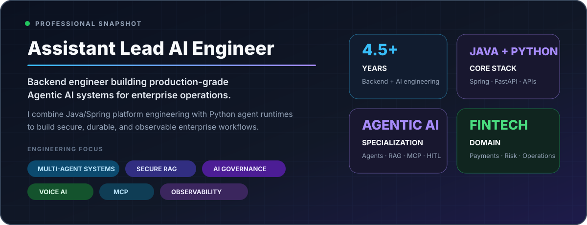
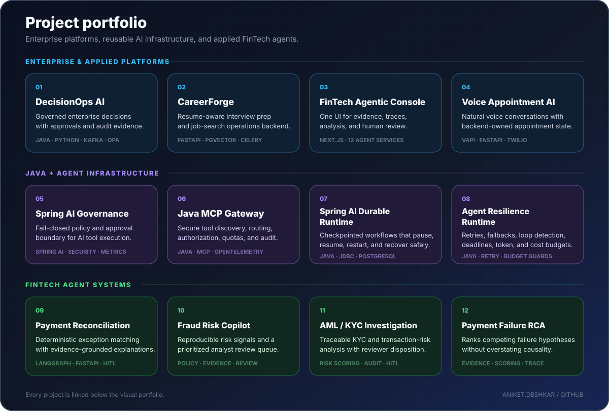
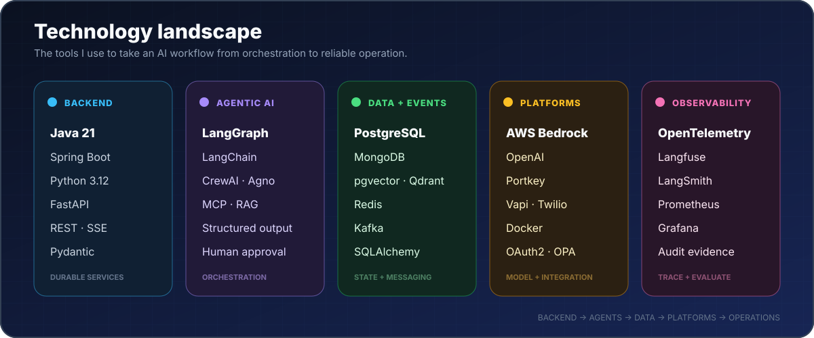
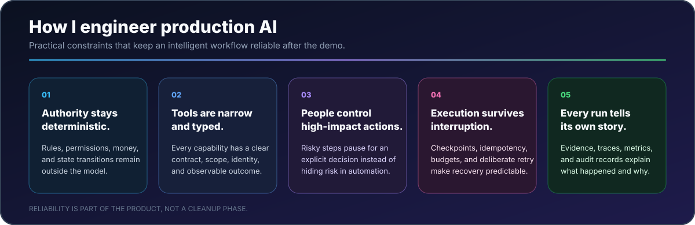

  
  

  

 

  

  <strong>OPEN A REPOSITORY</strong>
    
  <a href="https://github.com/aniket-deshkar/enterprise-agentic-operations-platform">DecisionOps AI</a> ·
  <a href="https://github.com/aniket-deshkar/interview-prep-platform-api">CareerForge</a> ·
  <a href="https://github.com/aniket-deshkar/fintech-agentic-console">FinTech Console</a> ·
  <a href="https://github.com/aniket-deshkar/voice-agent">Voice Appointment AI</a>
   
  <a href="https://github.com/aniket-deshkar/spring-ai-governance">Spring AI Governance</a> ·
  <a href="https://github.com/aniket-deshkar/java-mcp-gateway">Java MCP Gateway</a> ·
  <a href="https://github.com/aniket-deshkar/spring-ai-durable-runtime">Spring AI Durable Runtime</a> ·
  <a href="https://github.com/aniket-deshkar/agent-resilience-runtime">Agent Resilience Runtime</a>
   
  <a href="https://github.com/aniket-deshkar/agentic-payment-ops-reconciliation">Payment Reconciliation</a> ·
  <a href="https://github.com/aniket-deshkar/fraud-investigation-risk-copilot">Fraud Risk Copilot</a> ·
  <a href="https://github.com/aniket-deshkar/aml-kyc-investigation-agent">AML/KYC Investigation</a> ·
  <a href="https://github.com/aniket-deshkar/payment-failure-rca-agent">Payment Failure RCA</a>

 

  

 

  

 

  <h3>Build intelligent systems. Keep their behaviour explainable.</h3>
  
Agent runtimes · AI governance · Java + AI architecture · Secure RAG · FinTech automation · Voice AI

  <a href="https://www.linkedin.com/in/aniket-deshkar"><strong>Connect on LinkedIn</strong></a>
  &nbsp;•&nbsp;
  <a href="https://github.com/aniket-deshkar?tab=repositories"><strong>Explore all repositories</strong></a>

