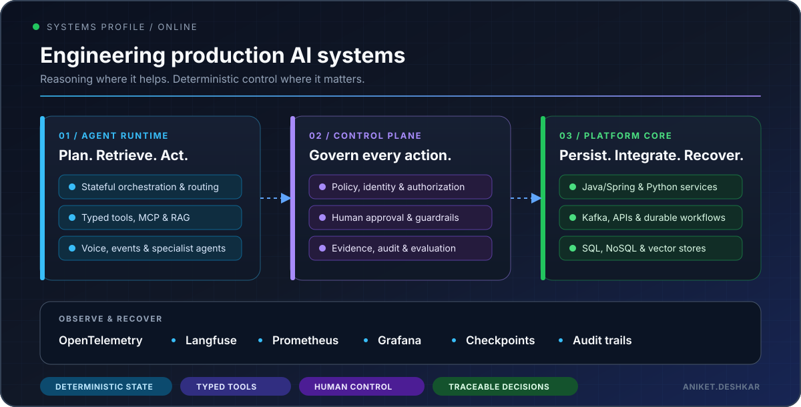

  
  

  

## Engineering profile

### I build AI systems that can take useful action—and still be trusted when the workflow gets complicated.

Hi, I’m Aniket—an **Assistant Lead AI Engineer** with **4.5+ years across backend and AI engineering**. I work on enterprise GenAI and Agentic AI systems, particularly where decisions involve real business rules, multiple data sources, external tools, and human accountability.

My strongest work happens at the boundary between **AI orchestration and backend reliability**: Java/Spring services that own durable business state, Python/FastAPI runtimes that coordinate agents, and a control plane that keeps tool use authorized, observable, and recoverable. Recent areas include **FinTech operations, secure RAG, conversational analytics, voice automation, and approval-driven workflows**.

> The model can reason and explain. The surrounding system must still enforce policy, protect data, and recover when something fails.

## Selected systems

### Flagship platform · Enterprise decision operations

#### [DecisionOps AI](https://github.com/aniket-deshkar/enterprise-agentic-operations-platform)

A policy-controlled decision-operations platform where deterministic services own business state and narrowly scoped AI tools assist pricing, procurement, compliance, finance, and operational workflows. Human approvals, Kafka events, and audit evidence are part of the architecture—not later additions.

`Java 21` · `Python` · `Kafka` · `PostgreSQL` · `OPA` · `OpenTelemetry`

### Java + AI infrastructure

| Project | Purpose |
|---|---|
| [**Spring AI Governance**](https://github.com/aniket-deshkar/spring-ai-governance) | A fail-closed security boundary for Spring AI tool calls, with identity-aware authorization, typed argument rules, approval decisions, audit events, and metrics |
| [**Java MCP Gateway**](https://github.com/aniket-deshkar/java-mcp-gateway) | A controlled MCP tool gateway with explicit exposure, authorization hooks, quotas, health decisions, sanitized failures, audit events, and telemetry |
| [**Spring AI Durable Runtime**](https://github.com/aniket-deshkar/spring-ai-durable-runtime) | A checkpointed Java runtime for model and tool workflows that can pause, restart, resume, fail, or cancel without repeating completed steps |

### Applied agent systems

| Project | Problem being solved |
|---|---|
| [**CareerForge**](https://github.com/aniket-deshkar/interview-prep-platform-api) | Brings resume-aware interview preparation, semantic retrieval, application tracking, and provider integrations into one production-oriented backend |
| [**AI Voice Appointment Assistant**](https://github.com/aniket-deshkar/voice-agent) | Separates natural voice conversations from typed, validated appointment state changes so the assistant cannot make unauthorized updates |
| [**Agentic Payment Reconciliation**](https://github.com/aniket-deshkar/agentic-payment-ops-reconciliation) | Combines deterministic reconciliation with evidence-grounded explanations, persisted traces, and explicit human review |

## Technical range

| Layer | Tools and technologies |
|---|---|
| **Languages & APIs** | Java 21 · Python 3.12 · Spring Boot · FastAPI · REST · SSE · Pydantic |
| **Agentic AI** | LangGraph · LangChain · CrewAI · Agno · MCP · RAG · structured outputs |
| **Models & platforms** | OpenAI · AWS Bedrock · Portkey · Vapi · Twilio |
| **Data & messaging** | PostgreSQL · MongoDB · pgvector · Qdrant · Redis · Kafka · SQLAlchemy |
| **Platform engineering** | Docker · OAuth2/OIDC · RBAC · OPA · GitHub Actions |
| **Observability** | OpenTelemetry · Prometheus · Grafana · Langfuse · LangSmith |

## Production principles

- **Keep authority outside the model.** Business rules, permissions, calculations, and state transitions remain deterministic.
- **Give agents narrow, typed capabilities.** Every tool has a clear contract, limited scope, and an observable result.
- **Design for interruption.** Workflows checkpoint progress, retry deliberately, and resume without repeating completed side effects.
- **Put people at the right control points.** High-impact actions pause for review instead of hiding risk behind automation.
- **Make behaviour explainable.** Traces, metrics, evidence, and audit records should tell the story of every run.

## Let’s connect

I’m always happy to discuss **agent runtimes, AI governance, Java + AI architecture, secure RAG, FinTech automation, voice AI, and production backend systems**.

  <a href="https://www.linkedin.com/in/aniket-deshkar"><strong>Connect on LinkedIn</strong></a>
  &nbsp;•&nbsp;
  <a href="https://github.com/aniket-deshkar?tab=repositories"><strong>Explore all repositories</strong></a>

