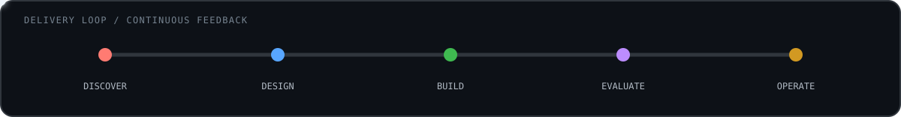

 

`India` &nbsp; `4.5+ years` &nbsp; `Enterprise AI` &nbsp; `Regulated software`

 

## `01` About

> ### I turn ambiguous enterprise workflows into governed AI systems.

I work across the full delivery path—from use-case discovery and architecture to
implementation, evaluation, and production handoff. My experience spans
enterprise AI, cross-border payments, healthcare supply chains, and other
regulated environments.

I care about the parts that make intelligent systems dependable: narrow tool
contracts, measurable retrieval quality, human approval for consequential
actions, durable audit evidence, and observability that explains failures.

 

 

## `02` Engineering focus

| | Discipline | How I approach it |
|:--:|---|---|
| `01` | **Agentic systems** | Stateful multi-step agents, narrow tool contracts, deterministic policy checks, and human approval before consequential actions. |
| `02` | **Retrieval & evaluation** | Retrieval pipelines measured rather than assumed—with evaluation harnesses, vector-store comparisons, and regression checks. |
| `03` | **Backend platforms** | High-throughput services built around idempotency, durable messaging, caching strategy, and graceful load shedding. |
| `04` | **Reliability & governance** | Traces, metrics, replayable execution records, tenant-aware authorization, and append-only audit evidence. |

 

## `03` Selected systems

<table>
<tr>
<td width="50%" valign="top">
<h3><a href="https://github.com/aniket-deshkar/enterprise-agentic-operations-platform">DecisionOps AI ↗</a></h3>
<strong>Enterprise agentic operations</strong>

Policy-controlled AI tools, approval gates, tenant-aware authorization, and durable audit evidence—designed for decisions that must remain explainable.

<code>Java 21</code> <code>Spring Boot</code> <code>LangGraph</code> <code>Kafka</code> <code>Qdrant</code> <code>OPA</code>
</td>
<td width="50%" valign="top">
<h3><a href="https://github.com/aniket-deshkar/settlement-sentinel">Settlement Sentinel ↗</a></h3>
<strong>Governed payment investigation</strong>

Retrieves evidence, analyzes settlement cases, validates policy remotely, and proposes bounded adjustments with explicit controls.

<code>Python</code> <code>Google ADK</code> <code>Gemini</code> <code>MCP</code> <code>FastAPI</code>
</td>
</tr>
<tr>
<td width="50%" valign="top">
<h3><a href="https://github.com/aniket-deshkar/Custom_Agentic_RAG">Custom Agentic RAG ↗</a></h3>
<strong>Retrieval evaluation framework</strong>

A scratch-built framework for comparing vector databases and model backends—making retrieval quality visible, testable, and repeatable.

<code>Python</code> <code>RAG</code> <code>Embeddings</code> <code>Vector DBs</code> <code>LLMs</code>
</td>
<td width="50%" valign="top">
<h3><a href="https://github.com/aniket-deshkar/voice-agent">AI Voice Appointment Assistant ↗</a></h3>
<strong>Production-minded voice automation</strong>

Outbound appointment confirmation, cancellation, rescheduling, and human escalation with validated state changes and safe webhook handling.

<code>Vapi</code> <code>Twilio</code> <code>FastAPI</code> <code>Groq</code> <code>Langfuse</code>
</td>
</tr>
</table>

 

## `04` Toolkit

| Layer | Technologies |
|---|---|
| **Languages** | `Java 8 / 11 / 17 / 21` · `Python 3.12` · `TypeScript` · `JavaScript` · `SQL` |
| **AI systems** | `LangGraph` · `LangChain` · `LlamaIndex` · `MCP` · `RAG` · `RAGAS` · `Human-in-the-loop` |
| **Backend** | `Spring Boot` · `FastAPI` · `REST / OpenAPI` · `GraphQL` · `Kafka` · `Celery` · `Redis` |
| **Data** | `PostgreSQL` · `pgvector` · `Qdrant` · `MongoDB` · `DynamoDB` · `Elasticsearch` |
| **Operations** | `AWS` · `Docker` · `GitHub Actions` · `OpenTelemetry` · `Prometheus` · `Grafana` |

 

## `05` Credentials

- **AWS Certified AI Practitioner** — AIF-C01
- **Microsoft Certified: Azure Fundamentals** — AZ-900
- **B.E., Electronics & Telecommunication Engineering** — RTM Nagpur University
- **Diploma, Electronics & Telecommunication** — MSBTE

 

### Useful. Governed. Dependable.

I am always interested in hard problems where AI capability and production
discipline have to coexist.

[**Explore my repositories →**](https://github.com/aniket-deshkar?tab=repositories)&nbsp;&nbsp;·&nbsp;&nbsp;[**Start a conversation →**](mailto:aniket.deshkar@proton.me)

Designed as an engineering profile—not a list of technologies.

